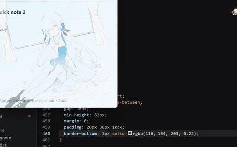

# ヰnote

[English](Docs/Readme-En.md)<br>[日本語](Docs/Readme-Ja.md)

<!-- markdownlint-disable -->
<div align="center">

# ヰnote

简单的快捷记录工具

[报告问题](https://github.com/TsukiraiSaigiaochi/-Note/issues) <br>· [下载发行版](https://github.com/TsukiraiSaigiaochi/-Note/releases/tag/APP)

[](https://github.com/TsukiraiSaigiaochi/-Note/releases/tag/APP)
[](LICENSE)
</br>


<br>

</div>

<!-- markdownlint-restore -->

---

## 关于

ヰnote 是一个轻量的本地便签工具。<br>
没什么复杂的功能，也缺乏可玩的功能<br>
它更接近一个桌面上的草稿本：需要的时候打开，写下几句话，然后继续做自己的事情。

## 动机

我一直想找一个用着顺手、随叫随到的简单笔记软件。

正好我又是个ヰ组，当然也希望写笔记的时候能看着我推写。

于是，在一个不想复习期末考试的下午，它诞生了。

## 特性
- **MD支持** — 支持 Markdown 语法，用更接近写作的方式记录想法

  

- **快捷笔记** — 通过托盘或全局快捷键随时唤出便签窗口

  

- **本地储存** — 笔记内容保存在本地，不依赖云端服务

- **MD导入** — 支持 `.md` 文件导入

## 说明
- 在打开程序后，CTRL+ALT+A唤出主窗口
- 在打开程序后，CTRL+ALT+Q唤出快捷窗口

## Use Cases

- **像使用桌子上的草稿本一样使用它**

- 写代码的时候随手记一下思路

- 打游戏的时候随手记一下注意事项

- 看资料、听课、复习时快速记录片段想法

- 给老师、领导、朋友，甚至 AI 发送消息前，先在这里编辑一遍

- 当作临时剪贴板，暂存需要反复复制的文本

## 下载

下载链接[GitHub Releases](https://github.com/TsukiraiSaigiaochi/-Note/releases/tag/APP).

Windows用户可以从发布下载
> This project is still under development.  
> If you encounter any problems, feel free to report them in [Issues](https://github.com/TsukiraiSaigiaochi/-Note/issues).

## Build
### Requirements

- [Node.js](https://nodejs.org/) 18+
- [Rust](https://www.rust-lang.org/tools/install)
- [Tauri CLI 2](https://tauri.app/)

### Steps

```bash
git clone https://github.com/TsukiraiSaigiaochi/-Note.git

cd -Note

pnpm install

# Run in development mode
pnpm tauri dev

# Build release version
pnpm tauri build
```

The build output is usually located at:

```text
src-tauri/target/release/bundle/
```


## Star History

[](https://star-history.com/#TsukiraiSaigiaochi/-Note&Date)

## Contributors

[](https://contrib.rocks/image?repo=TsukiraiSaigiaochi/-Note&max=1000)

## License

[MIT](LICENSE)

